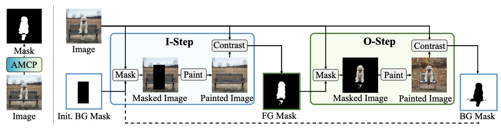

<font color="red">Developed an innovative autoprompting system for PaintSeg, automating input generation for training-free object segmentation. Leveraged k-means clustering for color-based segmentation and the Dense Prediction Transformer (DPT) model to extract depth maps, creating precise binary and bounding box masks without manual input. Experiments on the DUTS dataset showed IOU scores between 45% and 55%, with enhancements up to 60% using a hybrid prompting strategy. This approach significantly streamlines the segmentation process and paves the way for further automation in image processing tasks.</font>

# Abstract
<!--  -->
Abstract
Object segmentation in visual computing has traditionally relied on manual or
semi-supervised methods that require extensive training and human intervention
for prompt specification. This paper introduces an innovative autoprompting system
designed to automate the input generation for PaintSeg, a training-free and
unseen object segmentation model. Our methodology leverages k-means clustering
for color-based segmentation and employs the Dense Prediction Transformer
(DPT) model to extract depth maps, creating precise binary and bounding
box masks without manual input. Conducted experiments on the DUTS dataset
demonstrated that our autoprompting approach achieves Intersection Over Union
(IOU) scores between 45 and 55 percent, with an enhancement of up to 60 percent
through a hybrid prompting strategy that intelligently combines mask types based
on their spatial characteristics. This work not only streamlines the segmentation
process but also opens new avenues for further automation in image processing
tasks.
<p align="center"></p>

Project Report/Paper:
> [**Automating Prompt Generation for Training-Free
Object Segmentation in PaintSeg**](AdvML_ProjectReport_Group_6.pdf)
>
> Xiang Li, Chung-Ching Lin, Yinpeng Chen, Zicheng Liu, Jinglu Wang, Bhiksha Raj

Reference Paper:
> [**PaintSeg: Training-free Segmentation via Painting**](https://arxiv.org/abs/2305.19406)
>
> Xiang Li, Chung-Ching Lin, Yinpeng Chen, Zicheng Liu, Jinglu Wang, Bhiksha Raj

# Updates
- **(2023-11)** Demo released!
- **(2023-09)** PaintSeg is accepted to NeurIPS 2023!


## Environment setup
```
conda env create -f environment.yaml
conda activate PaintSeg
pip install -e git+https://github.com/CompVis/taming-transformers.git@master#egg=taming-transformers
pip install --force-reinstall cython==0.29.36
pip install --no-build-isolation git+https://github.com/lucasb-eyer/pydensecrf.git
```
## Datasets
Download datasets and put them in the main folder.
ECSSD, DUTS, PASCAL VOC, COCO MVal, GrabCut, Berkeley, DAVIS.

## Run
```angular2html
python scripts/PaintSeg.py --outdir $outdir$ --iters $iter_num$ --steps $diffusion step$ --dataset $dataset$ 
```
## Citation
```
@inproceedings{li2023paintseg,
  title={PaintSeg: Painting Pixels for Training-free Segmentation},
  author={Li, Xiang and Lin, Chung-Ching and Chen, Yinpeng and Liu, Zicheng and Wang, Jinglu and Singh, Rita and Raj, Bhiksha},
  booktitle={Thirty-seventh Conference on Neural Information Processing Systems},
  year={2023}
}
```
